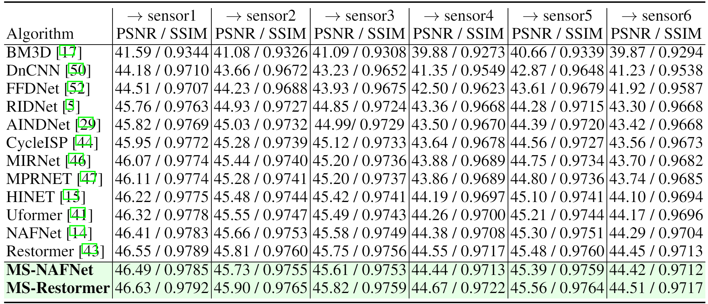

## MSSIDD: A Benchmark for Multi-Sensor Denoising

The official pytorch implementation of the paper **MSSIDD: A Benchmark for Multi-Sensor Denoising**

#### Shibin Mei\*, Hang Wang\*, Bingbing Ni

>The cameras equipped on mobile terminals employ different sensors in different photograph modes, and the transferability of raw domain denoising models between these sensors is significant but remains sufficient exploration. Industrial solutions either develop distinct training strategies and models for different sensors or ignore the differences between sensors and simply extend existing models to new sensors, which leads to tedious training or unsatisfactory performance. 
>In this paper, we introduce a new benchmark, the Multi-Sensor SIDD (MSSIDD) dataset, which is the first raw-domain dataset designed to evaluate the sensor transferability of denoising models. The MSSIDD dataset consists of 60,000 raw images of six distinct sensors, derived through the degeneration of sRGB images via different camera sensor parameters. Furthermore, we propose a sensor consistency training framework that enables denoising models to learn the sensor-invariant features, thereby facilitating the generalization of the consistent model to unseen sensors. 
>We evaluate previous arts on the newly proposed MSSIDD dataset, and the experimental results validate the effectiveness of our proposed method. Our dataset is publicly available at https://www.kaggle.com/datasets/sjtuwh/mssidd.



### Installation
This implementation based on [BasicSR](https://github.com/xinntao/BasicSR) which is a open source toolbox for image/video restoration tasks

```python
python 3.9.5
pytorch 1.11.0
cuda 11.3
```

```
git clone https://github.com/xxxx/xxxx
cd MSSIDD
pip install -r requirements.txt
```

To install basicsr into your conda environment, you can either run,
```
python setup.py develop --no_cuda_ext
```
or add a path to your python execution environment,
```
import sys
sys.path.insert(0, '/your/path/to/MSSIDD')
```

### MSSIDD dataset

We provide a simple demo for prepare MSSIDD dataset and dataloader in Pytorch.

See **notebooks/MSSIDD_demo.ipynb**.

### Model training 
* NAFNet Raw2Raw setting:
    * $\rightarrow$ sensor6:
    ```
    CUDA_VISIBLE_DEVICES=0,1 python -m torch.distributed.launch --nproc_per_node=2 --master_port=4321 --use-env basicsr/train.py -opt options/train/MSSIDD/NAFNet-width64_mssidd_raw2raw_12345_6_zs_2400_12800.yml --launcher pytorch
    ```
* NAFNet Raw2RGB setting:
    * $\rightarrow$ sensor6:
    ```
    CUDA_VISIBLE_DEVICES=0,1 python -m torch.distributed.launch --nproc_per_node=2 --master_port=4321 --use-env basicsr/train.py -opt options/train/MSSIDD/NAFNet-width64_mssidd_raw2raw_isp_12345_6_zs_2400_12800.yml --launcher pytorch
    ```

### Citations
If MSSIDD helps your research or work, please consider citing our benchmark.

```
@misc{shibin_mei_hang_wang_bingbing_ni_2024,
	title={MSSIDD},
	url={https://www.kaggle.com/dsv/8533876},
	DOI={10.34740/KAGGLE/DSV/8533876},
	publisher={Kaggle},
	author={Shibin Mei and Hang Wang and Bingbing Ni},
	year={2024}
}
```

### Contact

If you have any questions, please contact shibin.mei1027@gmail.com or francis970625@gmail.com


